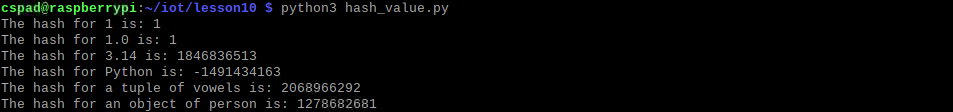
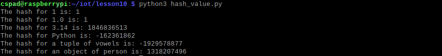
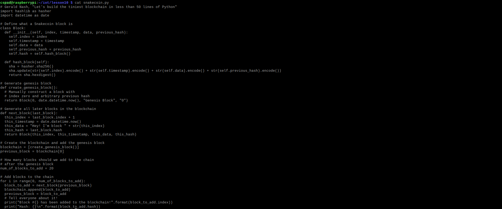
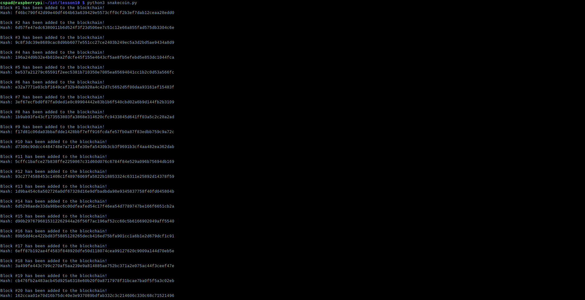
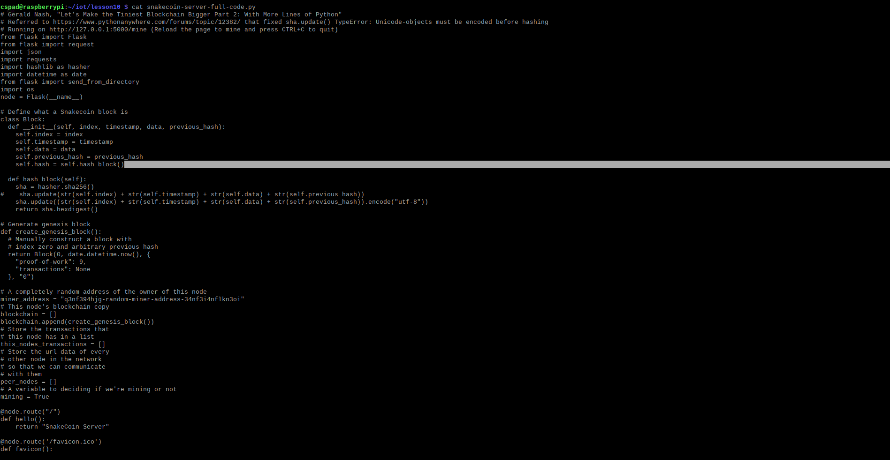
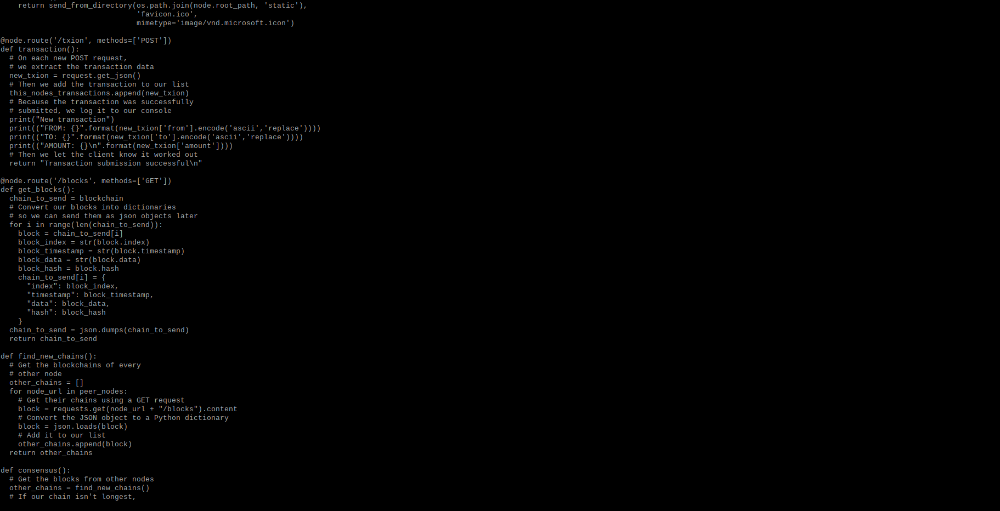
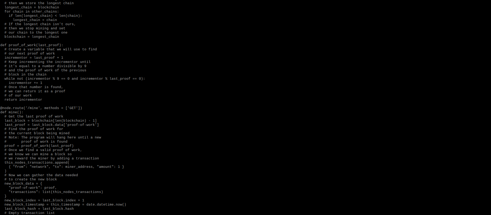
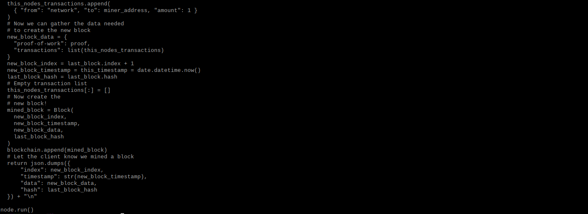
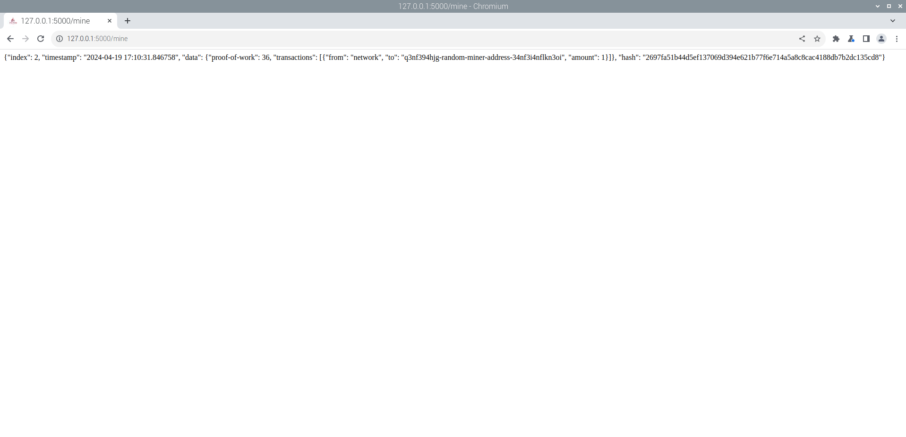

**python3 hash_value.py**

**cat snakecoin.py**

**python3 snakecoin.py**

**cat snakecoin-server-full-code.py**

**SnakeCoin Server**

**SnakeCoin Server Mine**

**Python Blockchain App**

**Python Blockchain App Mine**

**Python Blockchain App Blocks**

