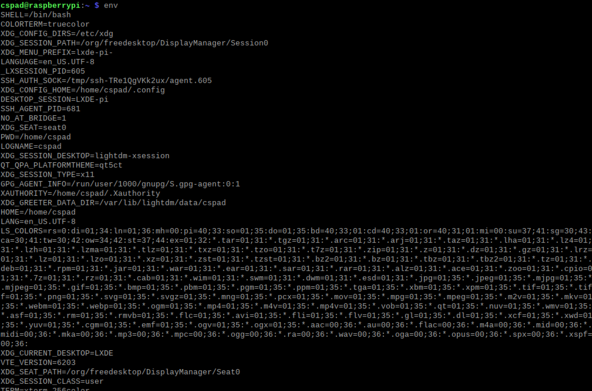

**hostname**

**env**

**ps**

**pwd**

**git clone**

**cd iot** 

**ls**

**cd**

**df**

**mkdir demo**

**cd demo**

**nano file**

**cat file**

**cp file file1**

**mv file file2**

**rm file2**

**clear**

**man uname**

