**cd ~/iot**
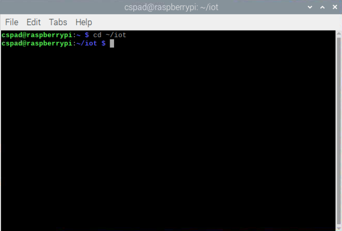
**cd 3**
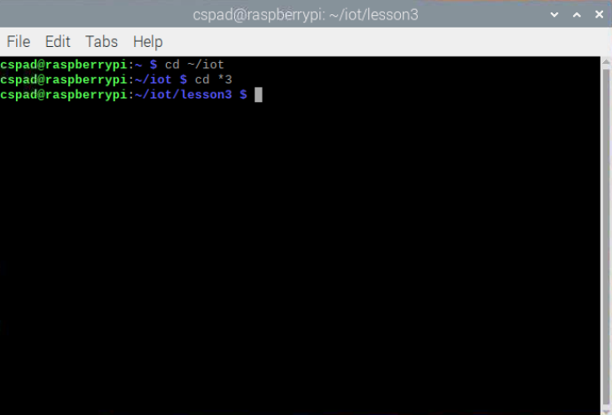
**python3 julian.py**

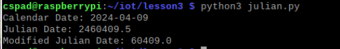

**python3 date_example.py**
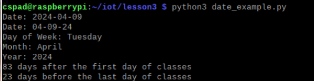
**python 3 datetime_example.py**
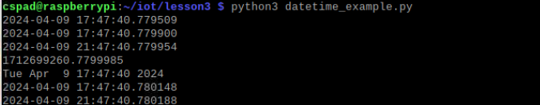
**python 3 time_example.py**
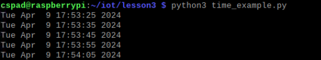
**python3 sun.py "New York"**
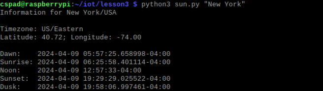
**python3 moon.py**
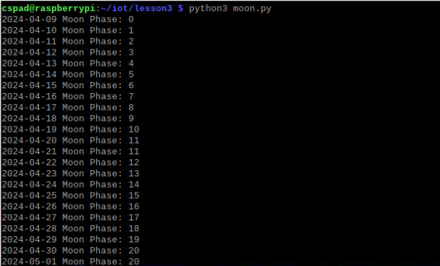
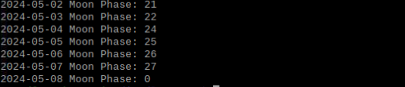
**python 3 coordinates.py "Samuel C. Williams Library"**
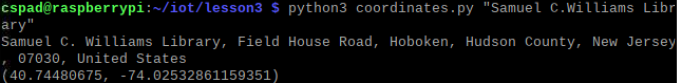
**python3 address.py "40.74480675, -74.02532861159351"**
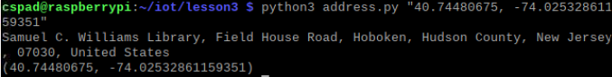
**python3 cpu.py**
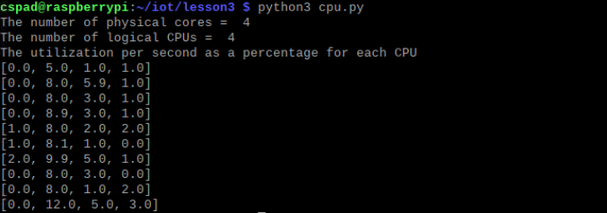
**python3 battery.py**

**python3 documentstats.py document.txt**
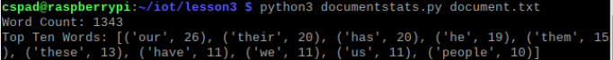
