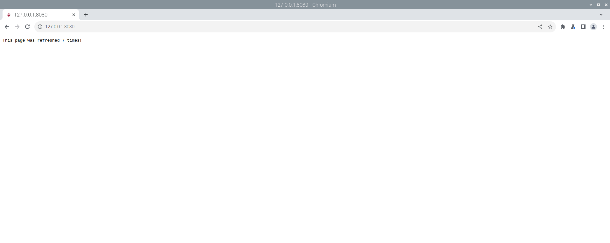
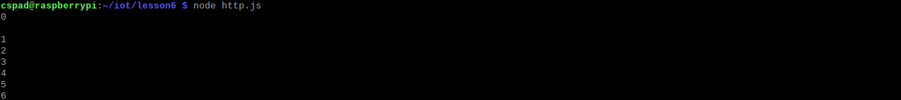
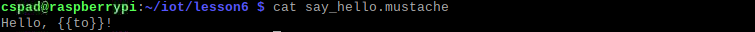
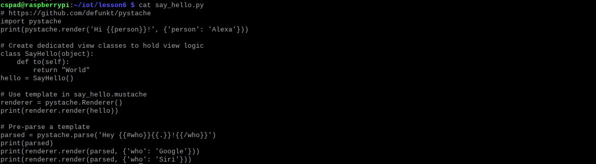
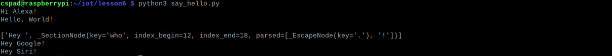

**Node -v**

**Npm -v**

**Node -h**

**cd iot lesson 6**

**node hello_world.js**

**node hello.js**

**node http.js**

**cd iot lesson 6**

**cat say_hello.mustache**

**cat say_hello.py**

**python3 say_hello.py**

