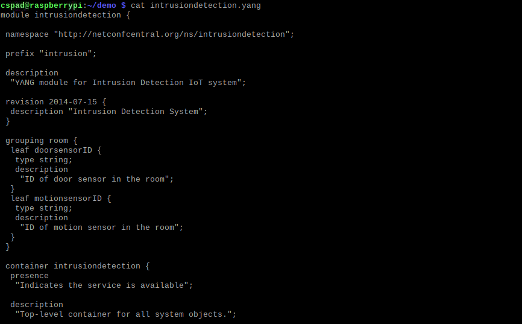
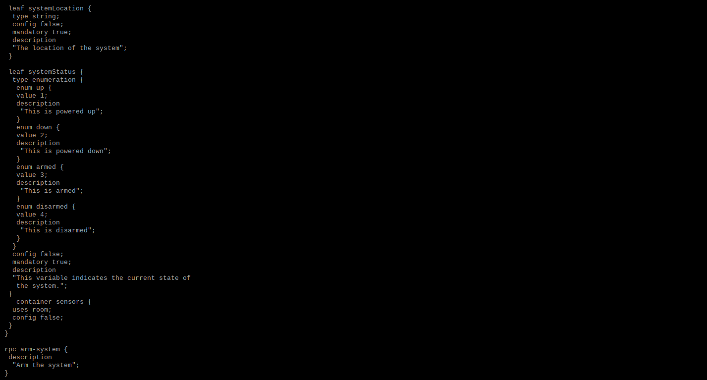
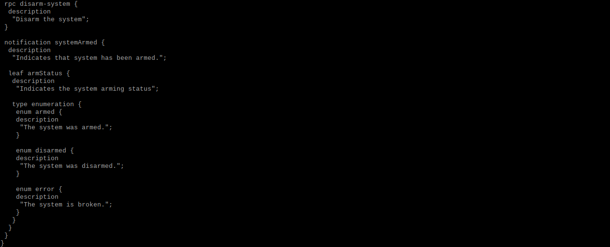
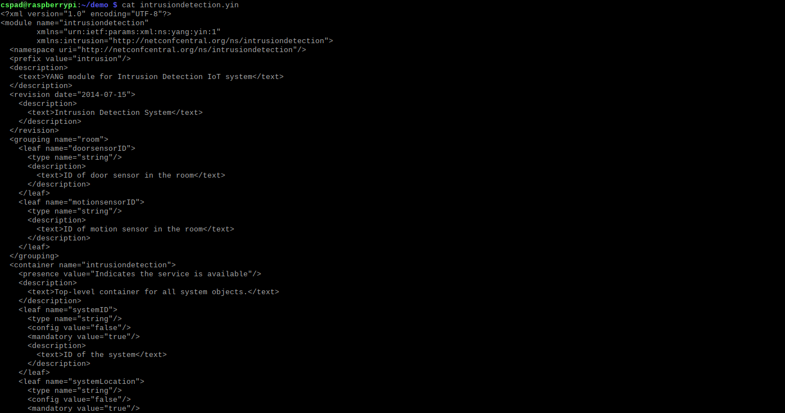
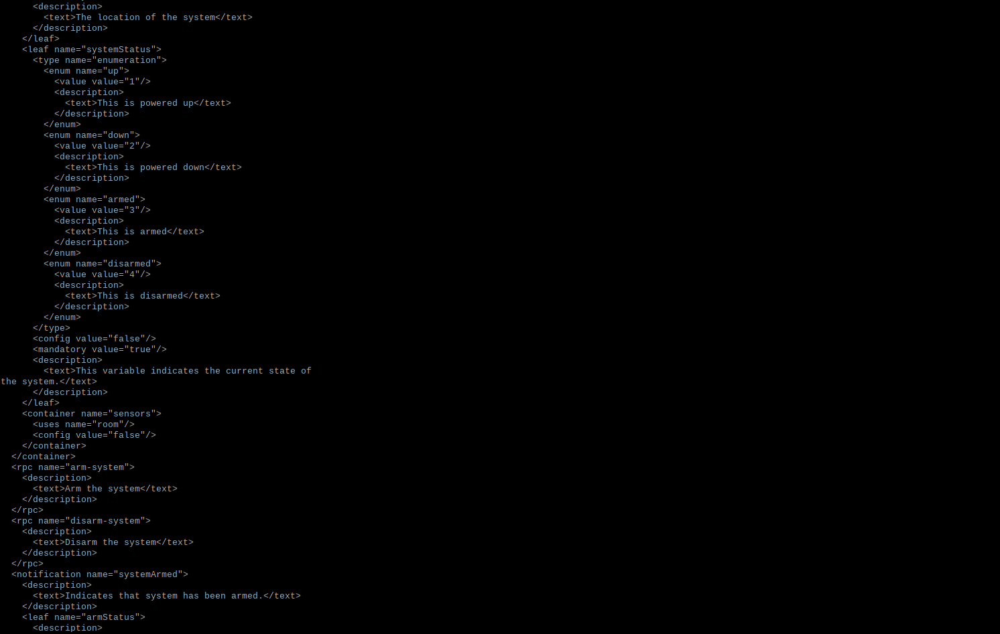
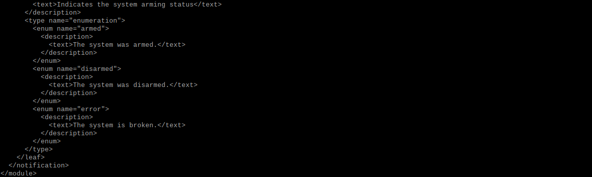
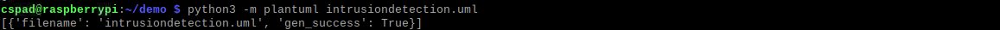

**cat intrusiondetection.yang**

**pyang -f yin -o intrusiondetection.yin intrusiondetection.yang**

**cat intrusiondetection.yin**

**pyang -f uml -o intrusiondetection.uml**

**cat intrusiondetection.uml**

**python3 -m plantuml intrusiondetection.uml**

